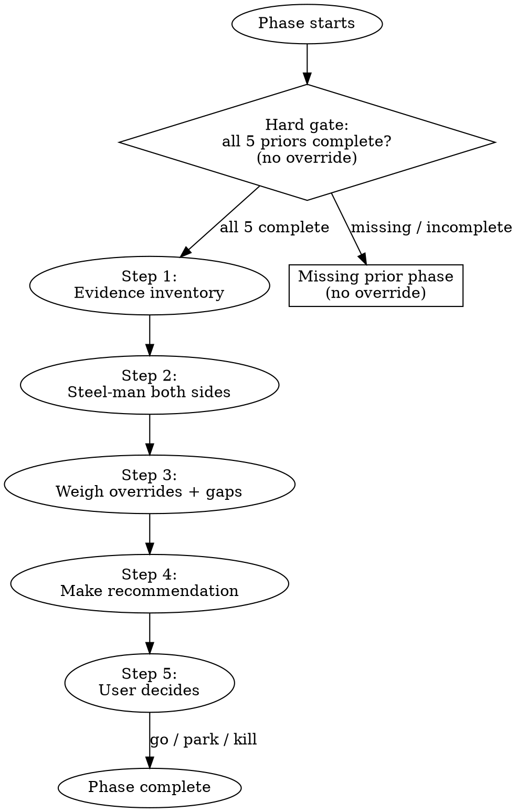

# Idea Decide — Phase 6: Verdict

Synthesize all prior thinking into a terminal verdict: **go**, **park**, or **kill**. This is the product — every phase exists to serve this decision.

## On Start

1. Read `CONVENTIONS.md` for shared protocols.
2. If `$ARGUMENTS` is provided, use it as the idea slug. Otherwise ask: "Which idea?"
3. Set the working directory to `ideas/<idea-slug>/`.
4. **Hard gate (no override):** ALL 5 prior artifacts must exist with `status: complete`:
   - `CONCEPT.md`
   - `VALIDATION.md`
   - `GTM.md`
   - `FEASIBILITY.md`
   - `MVP.md`
   
   If any are missing or `status` is not `complete`:
   > "Can't reach a verdict without the homework. Missing or incomplete: [list with status]. Run the earlier phases first."
   
   **No override.** Deciding without the analysis defeats the purpose.

5. Check if `DECISION.md` exists — if so, read it and pick up where things left off.
6. Read ALL 5 prior artifacts thoroughly. Extract:
   - Each phase's `verdict` (traffic light)
   - Each phase's `evidence_strength`
   - Every `overridden` / `override_reason` pair
   - Every entry in each phase's `gaps` array
   - All `key_risks` across phases

## Transition Graph



## The Decision Process

### Step 1: Evidence inventory

Before arguing either side, lay out the evidence foundation:

For each prior phase, state:
- **Verdict:** proceed / proceed-with-caution / killer
- **Evidence strength:** strong / medium / weak
- **Override taken?** If yes, what was the reason?
- **Gap noted?** If yes, what and in which earlier phase?
- **Key risks:** the risk tags

This is the raw material. Present it honestly — don't spin it.

### Step 2: Steel-man both sides

**The case FOR go:**
- Strongest arguments from across all 5 phases.
- What makes this worth building?
- What's the upside scenario if the MVP succeeds?
- Reference specific findings: "Validation found [X], GTM identified [channel] with [CAC], feasibility confirmed [Y]."

**The case AGAINST go:**
- Strongest counterarguments from across all 5 phases.
- Every killer verdict, even if overridden.
- Every weak evidence assessment.
- Every unresolved gap.
- Every key risk.
- **Moat assessment:** Is this defensible over time? (Network effects, data, switching costs, brand, community, regulatory advantage.) If there's no moat, say so — a viable business with no defensibility is a different risk profile than one with compounding advantages. Draw on GTM's channel competition and feasibility's technical analysis to assess.
- **Do NOT soften this.** The user needs the full picture. If the idea should die, say so clearly.

### Step 3: Weigh overrides and gaps

Overrides are signal:
- An override with a strong reason ("hypothesis is cheap to test, worst case we lose 2 weeks") is a reasonable gamble.
- An override with a weak reason ("I just want to try") is a yellow flag.
- Multiple overrides compound — each one is a place where the analysis said "stop" and the user said "go."

Unresolved gaps are signal:
- A gap that was noted and left unaddressed means a dimension wasn't fully explored.
- Multiple gaps suggest the analysis was rushed.

Weigh these explicitly. Don't just mention them — state how they affect the verdict.

### Step 4: Make a recommendation

State your verdict:

**Go:** 
- Summarize the MVP scope (from MVP.md).
- Concrete next steps: create the repo, define first tasks, set up the first channel.
- What to watch for — the risks that could still derail this.

**Park:**
- What specific new information would change this to a go. Be concrete: "if you can demonstrate [X] through [method], revisit."
- For pivot-style parks: which insight from the analysis is valid, what to sharpen, which phase to restart from.
- When to revisit — a trigger event, not a calendar date.

**Kill:**
- Name the fatal flaw directly.
- What would have to be fundamentally different for this to work. (Not "try harder" — what structural change?)
- What's salvageable — any insights from the analysis worth carrying forward.

**Own the recommendation.** No hedging. "It depends on your risk tolerance" and "only you can decide" are banned. Have an opinion and defend it.

### Step 5: User decides

Present the recommendation and wait. The user has the final word. If they disagree:
- Ask them to articulate why.
- Capture their reasoning in DECISION.md.
- Their decision stands — but the analysis goes on record.

## Red Flags

When you hear any of these, respond with the pushback directly in prose. Do not accept a verdict without engagement.

| User says | Skill responds |
|---|---|
| "Let's just go for it" (without engaging) | "Which specific finding makes you confident? The analysis surfaced [risks]. Have you thought through those?" |
| "I don't care about the risks" | "The risks don't care. Which ones have you thought through, and which are you choosing to accept?" |
| "It feels right" | "Gut is data, but what evidence supports the feeling? The analysis says [X]." |
| "Let's park it" (as avoidance) | "Park needs a concrete trigger — what event or information would bring you back? Otherwise this is a comfortable kill." |
| "Kill it" (without engaging) | "Which finding drove that? The case-for had [X]. Are you sure the analysis doesn't support proceeding?" |
| "Can we just do a smaller version?" | "That's what MVP.md scopes. Does the MVP scope work, or do you want to revise it?" |

## Writing DECISION.md

````yaml
---
phase: decide
status: in-progress
verdict: null
evidence_strength: null
key_risks: []
overridden: false
override_reason: null
---
````

````markdown
# <Idea Name> — Decision

## Verdict: go | park | kill

## Evidence Inventory
[Per-phase table: verdict, evidence_strength, overrides, gaps, key risks]

## The Case For
[Steel-manned argument for building — citing specific phase findings]

## The Case Against
[Steel-manned argument against — not softened, citing specific phase findings]

## Override and Gap Analysis
[How overrides and unresolved gaps affected the verdict]

## Reasoning
[Why this verdict — which findings drove it, how evidence was weighed]

## What Would Change This
[For park: specific triggers. For kill: structural changes needed. For go: what could still derail.]

## Next Steps
[For go: concrete actions, starting with MVP. For park: revisit conditions. For kill: salvageable insights.]
````

**On completion:**
- `status: complete`
- `verdict: go | park | kill`
- `evidence_strength` — overall quality of evidence across all 5 phases.
- `key_risks` — the top risks, regardless of verdict.
