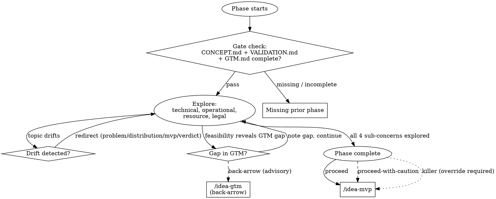

# Idea Feasibility — Phase 4

Can we build, run, afford, and legally operate this at the scale GTM implies? Four sub-concerns, evaluated against real distribution numbers — not in the abstract.

## On Start

1. Read `CONVENTIONS.md` for shared protocols.
2. If `$ARGUMENTS` is provided, use it as the idea slug. Otherwise ask: "Which idea?"
3. Set the working directory to `ideas/<idea-slug>/`.
4. **Gate check:**
   - Read `CONCEPT.md`, `VALIDATION.md`, `GTM.md`. All must exist with `status: complete`.
   - If any missing: "Feasibility needs concept, validation, and GTM. Missing: [list]."
   - If any has `verdict: killer`, apply the killer-verdict gate per CONVENTIONS.md.
5. Check if `FEASIBILITY.md` exists — if so, pick up where things left off.
6. Read all three priors. You need:
   - The target user and problem (CONCEPT.md)
   - The demand signal and alternatives (VALIDATION.md)
   - The channels, volume expectations, and cost structure (GTM.md)

**Key framing:** Feasibility is judged *against the scale GTM implies*. "Can we build it?" isn't abstract — it's "can we build it to serve the volume and channels GTM describes, at a cost that works?"

## Transition Graph



## How to Explore

**Use `AskUserQuestion` to drive the conversation.** Weave across all four sub-concerns — don't do them sequentially. They interact: a technical choice affects resource costs; a legal constraint limits operational approach; resource limits shrink what's technically possible. Follow whatever thread the user's answer opens.

Feasibility doesn't exist in isolation — every sub-concern connects back to prior phases. When a finding in any dimension tensions against what GTM, validation, or concept established, surface it immediately. Don't save cross-cutting tensions for later — they're often the most important findings. Examples: a technical choice that breaks unit economics, an operational burden that doesn't scale to GTM's volume, a legal constraint that blocks the primary channel, a resource requirement that exceeds what the market size justifies.

When you surface a tension, the user will either resolve it (e.g., change approach) or accept the risk and move on. Both are valid — but they have different consequences for the artifact. Resolved tensions are recorded as resolved in Cross-Cutting Tensions. Accepted-but-unresolved tensions become entries in `key_risks` and pull `evidence_strength` down, which idea-decide will weigh against the idea.

### 1. Technical Feasibility
- What are the core technical challenges? (Not "what's the tech stack" — what's *hard* about building this?)
- Are there technical risks or unknowns? Things that might not work?
- External dependencies — APIs, data sources, services. What happens if they change pricing, rate-limit, or shut down?
- Build vs buy decisions — where does custom code add value vs where does off-the-shelf work?
- Scale requirements — given GTM's volume shape, what does the architecture need to handle?

### 2. Operational Feasibility
- What does running this look like day-to-day? (Infrastructure, support, content, moderation, manual processes)
- What breaks at scale? (Something that works for 100 users might collapse at 10,000.)
- What's the operational burden per user? (High-touch vs self-serve)
- Are there operational dependencies on specific people, skills, or vendors?

### 3. Resource Feasibility
- What does this cost to build? (Time, people, money — rough order of magnitude.)
- What does it cost to run monthly? (Infrastructure, salaries, services, support.)
- Given GTM's CAC and the revenue model from prior phases — do the numbers work?
- What's the runway needed to reach sustainability? (Months to breakeven, not "eventually.")
- Who builds this? Solo founder, small team, outsourced? Is that realistic for the complexity?

Surface tensions with GTM's cost structure explicitly: "GTM says CAC is $X, feasibility says operating cost per user is $Y. With revenue at $Z/user, the margin is [positive/negative]."

### 4. Legal and Compliance
- Are there regulations that apply? (Data privacy, financial services, healthcare, food safety, employment law, etc.)
- Licensing requirements?
- Liability exposure?
- Terms of service risks from platforms or APIs you'd depend on?
- International considerations if GTM targets multiple markets?

Don't assume compliance is simple. "We'll just handle it" is a red flag. If the user doesn't know the regulatory landscape, mark it as a key risk.

## Red Flags

When you hear any of these, respond with the pushback directly in prose. Do not accept the answer and continue.

| User says | Skill responds |
|---|---|
| "We'll figure out the tech later" | "The tech determines whether this is a weekend project or a 6-month build. What's the hardest technical problem?" |
| "It's just a simple app" | "Simple how? Walk me through what happens when a user does X. Where does the complexity hide?" |
| "We'll hire for that" | "Hire whom, at what cost, in what timeline? Is that talent available for what you can pay?" |
| "Legal won't be an issue" | "How do you know? What regulations could apply? If you're not sure, that's a risk we need to flag." |
| "We'll scale when we need to" | "GTM says you need to handle [X users/transactions]. Can the initial build handle that, or is a rewrite baked in?" |
| "It'll cost about $X" (vague) | "Break it down. Infrastructure? Salaries? Services? Vague cost estimates hide surprises." |
| "We can outsource the whole thing" | "Outsource to whom? At what quality? Who manages the relationship? Outsourcing has coordination costs." |
| User can't answer a question | Don't fill in guesses. Flag it as a key risk and move on. Unknown feasibility dimensions are critical inputs for decide. |

## Boundary Enforcement

**Never cross these boundaries.** Redirect every time, no exceptions.

| Drift toward | Response |
|---|---|
| Revisiting problem or demand | "That's VALIDATION.md territory. If you want to revise it, rerun `/eureka:idea-validate`. Here we're evaluating whether the validated problem can be feasibly addressed." |
| Distribution strategy changes | "Channel strategy lives in GTM.md. If feasibility suggests a channel won't work at scale, I'll note the gap." |
| MVP scoping | "We'll get to MVP scope next — right now we need to know what's feasible before we scope what to build." |
| Verdict | "Not yet — MVP scoping still needs to happen. Then decide." |

## Phase Transition

When all four sub-concerns have been explored:

> "Here's the feasibility picture: [summary — technical complexity, operational burden, cost structure, legal flags]. When you're ready, `/eureka:idea-mvp` will scope the smallest concrete thing you could ship to test the core hypothesis. Want to dig deeper, or move on?"

**Never auto-transition.**

## Writing FEASIBILITY.md

````yaml
---
phase: feasibility
status: in-progress
verdict: null
evidence_strength: null
key_risks: []
overridden: false
override_reason: null
gaps: []
---
````

````markdown
# <Idea Name> — Feasibility Analysis

## Technical
[Core challenges, risks, dependencies, build vs buy, scale requirements]

## Operational
[Day-to-day running, what breaks at scale, per-user burden]

## Resource
[Build cost, run cost, runway to sustainability, team requirements]

## Legal and Compliance
[Applicable regulations, licensing, liability, platform ToS risks]

## Cross-Cutting Tensions
[Where sub-concerns conflict — e.g., technical approach is expensive but cheaper approach has legal risk]

## Cost vs Revenue Reality
[Explicit math: GTM's CAC + operating cost vs revenue per user. Does it work?]
````

Adapt to what emerged.

**On completion:**
- `verdict: proceed` — all four sub-concerns are green or yellow with mitigations.
- `verdict: proceed-with-caution` — one or more sub-concerns are red but addressable.
- `verdict: killer` — illegal at GTM's implied scale, or resource gap is unbridgeable, or technical approach is fundamentally unworkable.
- `evidence_strength` — based on how much rests on estimates vs actual research/quotes/data.
- `key_risks` from each sub-concern.

**Save after each significant exchange.**
