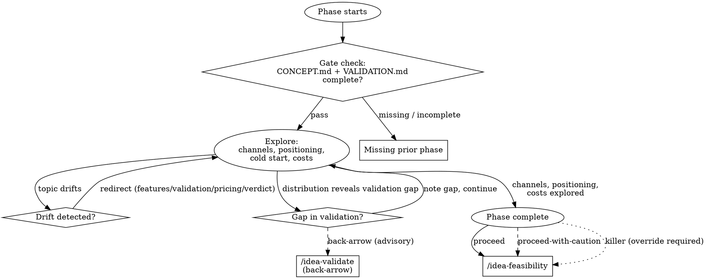

# Idea GTM — Phase 3

How does this idea reach its customers? The best product with no path to users is a dead product. This phase pressure-tests distribution, forces channel specificity, and builds positioning against the alternatives landscape from validation.

## On Start

1. Read `CONVENTIONS.md` for shared protocols.
2. If `$ARGUMENTS` is provided, use it as the idea slug. Otherwise ask: "Which idea?"
3. Set the working directory to `ideas/<idea-slug>/`.
4. **Gate check:**
   - Read `CONCEPT.md` and `VALIDATION.md`. Both must exist with `status: complete`.
   - If either is missing: "GTM needs a validated concept. Missing: [list]. Run the earlier phase first."
   - If either has `verdict: killer`, apply the killer-verdict gate per CONVENTIONS.md.
5. Check if `GTM.md` exists — if so, pick up where things left off.
6. Read both priors to ground the conversation — you need the target user, their problem, and the alternatives landscape.

## Transition Graph



## How to Explore

**Use `AskUserQuestion` to drive the conversation.** Follow whatever thread the user's answer opens. The areas below are ground to cover, not a checklist to march through.

### Where are the users?
Start from the target user in CONCEPT.md and the segments in VALIDATION.md, then go deeper:
- Where do these people already spend time? (Communities, platforms, events, publications, tools)
- How do they currently discover solutions? (Search, referrals, communities, sales outreach)
- What's their buying process? (Impulse, research-heavy, committee/approval, trial-first)
- Are there gatekeepers, influencers, or aggregators that reach them?

Demand specificity. "Small business owners" is not actionable. "Restaurant owners who search Yelp alternatives on Reddit and follow food-industry newsletters" is.

### Channel strategy
Given who they are and where they are, which channels fit? Not which channels exist — which ones actually reach *this* audience for *this* product.

For each viable channel, cover:
- **Why this channel** — what makes it a fit for this audience and product?
- **Approach** — strategy-level, not a setup guide. "Run targeted LinkedIn ads to CFOs at mid-market companies" not "how to create a LinkedIn campaign."
- **Cost signals** — rough CAC. Tie back to the idea's likely economics. "If LTV is $200 and LinkedIn ads cost $15-30/click with 2% conversion, CAC is $750-1500 — that doesn't work."

Don't suggest channels just because they exist. If the target user isn't on Instagram, say so.

### Cold start and chicken-egg
Matters most for marketplaces, platforms, and network-effect businesses. But probe whether it applies even for simpler products.
- Which side of the market first? Why?
- What's the minimum supply/demand to be useful?
- Can you start manual/concierge? (Things that don't scale to bootstrap the first cohort.)
- Single-player mode — is the product useful even without network effects?
- Existing communities or aggregations to tap into?

### Positioning
Using VALIDATION.md's alternatives landscape:
- Against the direct competitors: what's the positioning? (Not "we're better" — better how, for whom, in what context?)
- Against substitutes (spreadsheets, manual processes): what makes switching worth the effort?
- Against inaction: what triggers someone to finally solve this problem?

### Competitive landscape in channels
Where are competitors strong in distribution, and where are the gaps?
- If competitors dominate SEO for your keywords, what's the alternative?
- Are there underserved channels where your positioning gives you an edge?
- Can you differentiate on distribution, not just product? (e.g., a community-first approach in a space where competitors only do paid ads)
- Which channels are *winnable* given who else is already competing for attention there?

### Go-to-market sequence
Not just "which channels" but "in what order and why":
- **Phase 0 — Validation:** Before spending money. Landing pages, waitlists, manual outreach, small ad tests.
- **Phase 1 — First users:** Scrappy, unscalable things for the first 10-100 users.
- **Phase 2 — Growth:** Investment in scalable channels once you have PMF signals.
- What signals tell you to move from one phase to the next?

### Cost reality
- Estimated CAC per channel.
- Does CAC fit within plausible LTV? (Reference VALIDATION.md's willingness-to-pay signals if any.)
- Minimum budget to test each channel meaningfully.
- Time-to-results per channel. (SEO = months, paid = days.)

If marketing costs make unit economics negative, surface this as a critical tension.

## Red Flags

When you hear any of these, respond with the pushback directly in prose. Do not accept the answer and continue.

| User says | Skill responds |
|---|---|
| "We'll go viral" | "Virality is an outcome, not a strategy. What specific mechanic would cause one user to bring in others?" |
| "Word of mouth" | "Word of mouth is what happens when everything else works. What gets you the first users who do the talking?" |
| "Content marketing" | "Content marketing for whom, about what, distributed where? 'We'll write blog posts' is not a strategy." |
| "We'll just do SEO" | "For which keywords? Who ranks there now? What's your realistic timeline to page 1 against established players?" |
| "Build it and they'll come" | "Nobody comes. You go get them. Through which specific channel, at what cost?" |
| "We'll partner with X" | "Have you talked to X? What's in it for them? Partnerships require leverage — what's yours?" |
| "We don't have competitors" | "VALIDATION.md mapped alternatives. People doing nothing is your competitor. Why would they change?" |
| "We'll post on TikTok/Instagram" | "What evidence do you have that your target user discovers apps through these channels? Show me an example of a similar product that grew this way." |
| "Organic social is free" | "Organic social costs your time and has zero guaranteed reach. What's your plan when 20 posts get 50 views each?" |
| User can't answer a question | Don't fill in guesses. Note it as an open question and move on. A gap in distribution knowledge is a key risk for decide. |

## Boundary Enforcement

**Never cross these boundaries.** Redirect every time, no exceptions.

| Drift toward | Response |
|---|---|
| Product features, tech stack | "We're on distribution right now. Features come from feasibility + MVP. How do users find this?" |
| Revisiting problem validation | "The problem's mapped in VALIDATION.md. If you want to revise, rerun `/eureka:idea-validate`. Here we're focused on reaching the people who have it." |
| Pricing deep-dive | "Pricing matters for CAC/LTV math, but full pricing analysis is feasibility territory. Keep it rough here." |
| Verdict | "Not yet — feasibility and MVP still need to happen before decide." |

## Phase Transition

When channels, positioning, costs, and sequence are explored:

> "Here's the GTM picture: [summary — best channels, cold-start approach, CAC reality, positioning, channel competition]. When you're ready, `/eureka:idea-feasibility` will evaluate whether we can build, run, afford, and legally operate this at the scale GTM implies. Want to dig deeper, or move on?"

**Never auto-transition.**

## Writing GTM.md

````yaml
---
phase: gtm
status: in-progress
verdict: null
evidence_strength: null
key_risks: []
overridden: false
override_reason: null
gaps: []
---
````

````markdown
# <Idea Name> — Go-to-Market Strategy

## Where the Users Are
[Platforms, communities, events, publications — specific to target user from CONCEPT.md]

## Channel Strategy
[Per viable channel: why it fits, approach, cost signals]

## Cold Start Plan
[If applicable: which side first, minimum viable supply/demand, concierge approach]

## Positioning
[Against alternatives from VALIDATION.md — how, for whom, in what context]

## Competitive Landscape in Channels
[Where competitors are strong in distribution, where gaps exist, which channels are winnable]

## Go-to-Market Sequence
[Phase 0: validation → Phase 1: first users → Phase 2: growth. Transition signals.]

## Cost Reality
[CAC per channel, fit with LTV, budget to test, time-to-results]

## Key Tensions
[Where distribution conflicts with other dimensions]
````

Adapt to what emerged.

**On completion:**
- `verdict: proceed` — at least one channel is specific and plausibly cost-viable with positioning.
- `verdict: proceed-with-caution` — channels exist but cold-start is unresolved or CAC is uncertain.
- `verdict: killer` — CAC can't fit any plausible LTV, or no viable channel identified.
- `evidence_strength` based on how much channel/cost analysis rests on data vs guesses.
- `key_risks` from cold start, channel competition, cost uncertainties.

**Save after each significant exchange.**
