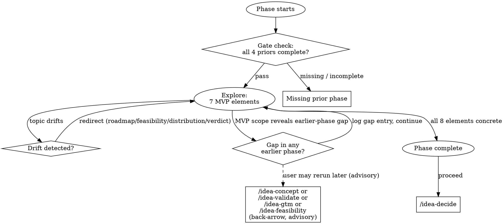

# Idea MVP — Phase 5

Given everything known, what's the smallest concrete thing we ship to test the core hypothesis? Not "version 1 of the product" — the minimum experiment that tells us whether to keep going.

## On Start

1. Read `CONVENTIONS.md` for shared protocols.
2. If `$ARGUMENTS` is provided, use it as the idea slug. Otherwise ask: "Which idea?"
3. Set the working directory to `ideas/<idea-slug>/`.
4. **Gate check:**
   - Read `CONCEPT.md`, `VALIDATION.md`, `GTM.md`, `FEASIBILITY.md`. All must exist with `status: complete`.
   - If any missing: "MVP needs all prior phases. Missing: [list]."
   - If any has `verdict: killer`, apply the killer-verdict gate per CONVENTIONS.md.
5. Check if `MVP.md` exists — if so, pick up where things left off.
6. **Gap resolution scan (Protocol B' — rerun case only):** MVP is the last downstream-authoring phase, so no later artifact references `phase: mvp` in its `gaps`. Nothing to scan. (DECISION.md does not log gaps — it weighs them.) Skip this step.
7. Read all four priors. You need:
   - The problem and target user (CONCEPT.md)
   - The demand signal and evidence strength (VALIDATION.md)
   - The best channel and cold-start approach (GTM.md)
   - The technical complexity, cost structure, and constraints (FEASIBILITY.md)

## Transition Graph



## How to Explore

**Use `AskUserQuestion` to drive the conversation.** The MVP must nail 8 specific elements. Drive the conversation until each is concrete. No vagueness allowed.

### 1. Core User
Who is the single most important user for the MVP? Not the full target market — the one person or segment that, if they use it and love it, validates the hypothesis. Reference VALIDATION.md's pain-severity ranking.

### 2. Core Hypothesis
One sentence: "We believe that [user] will [action] because [reason], resulting in [measurable outcome]." If the user can't state this crisply, the prior phases may have been too vague.

### 3. What's Built
The literal features included. Be minimal and specific:
- What screens, endpoints, workflows exist?
- What's the core interaction loop?
- Ruthlessly cut anything that doesn't directly test the hypothesis.

### 4. What's Faked
Equally important: what looks like it works but is actually manual, concierge, wizard-of-oz, or hardcoded?
- Which "features" are actually humans in the back end?
- Which integrations are mocked?
- What "automation" is actually a spreadsheet or manual process?

Faking is good — it reduces build time while still testing the hypothesis. Name it explicitly so decide can weigh build effort accurately.

### 5. Success Metric
One primary metric, with a number. Not "user engagement" but "30% of beta users return within 7 days." Not "revenue" but "$2,000 MRR within 60 days."

### 6. Kill Threshold
The number below which you stop. This must be set before launching, not after. "If fewer than [X] users do [Y] within [Z] days, this hypothesis is wrong."

### 7. Timebox
How long to build, how long to run the test. Total calendar time from start to verdict. Reference FEASIBILITY.md's complexity and resource estimates.

### 8. What's NOT Tested
Explicitly list what the MVP leaves unknown. Reference unresolved assumptions from VALIDATION.md and unresolved `gaps` entries from earlier artifacts (any entry where `resolved: false`). This prevents the illusion that a successful MVP validates everything. Each untested dimension should be named with a note on when/how it gets tested later.

## Handling Depth Gaps

MVP scoping often reveals weaknesses in **any** earlier phase — a hypothesis the concept never sharpened, a user segment validation didn't verify, a channel GTM glossed over, a technical constraint feasibility underpriced. Follow CONVENTIONS.md Protocol B:

1. Append an entry to `MVP.md`'s frontmatter `gaps` array:
   ```yaml
   - phase: concept | validate | gtm | feasibility
     note: <1-line description of the gap>
     severity: minor | significant
     resolved: false
     resolved_in: null
   ```
2. Tell the user: "I'm noting a <severity> gap in <phase> — <summary>. You can rerun `/eureka:idea-<phase>` later to close it, or leave it for idea-decide to weigh. Continuing."
3. Proceed with scoping. Advisory, not blocking.

MVP's verdict is always `proceed` — it scopes, it does not kill. Anything fundamentally unworkable belongs in a gap entry against the phase where the flaw lives (often feasibility, sometimes earlier).

## Red Flags

When you hear any of these, respond with the pushback directly in prose. Do not accept the answer and continue.

| User says | Skill responds |
|---|---|
| "We need to build the whole platform first" | "No. What's the one thing that tests whether people care? Everything else is premature." |
| "Users won't take it seriously if it's too basic" | "Users won't take it seriously if it doesn't solve their problem. Which features directly solve the problem?" |
| "We can't fake that — it won't feel real" | "Can you do it manually for the first 10 users? If manual doesn't work, what's the simplest automated version?" |
| "We'll know it when we see it" (no success metric) | "You need a number before you launch, not after. What does 'working' look like? Be specific." |
| "Let's launch and see what happens" (no kill threshold) | "See what, specifically? What result would make you stop? Set that now — after launch, you'll rationalize anything." |
| "We need 6 months" | "That's not an MVP, that's a product. What could you ship in 4 weeks that tests the core assumption?" |
| "Everything is essential" | "If everything is essential, the hypothesis is too broad. What's the single riskiest assumption? Test that." |
| User can't answer a question | Don't fill in guesses. If they can't state the core hypothesis or success metric, that's a signal the prior phases may have been too vague. Note the gap and probe a different element. |

## Boundary Enforcement

**Never cross these boundaries.** Redirect every time, no exceptions.

| Drift toward | Response |
|---|---|
| Full product roadmap | "This is the MVP, not v2. What tests the hypothesis? Everything else is later." |
| Revisiting feasibility | "Feasibility is done. If the MVP scope reveals new feasibility concerns, I'll log a `feasibility` gap entry in this artifact's frontmatter and flag it for decide." |
| Distribution details | "GTM has the channel strategy. The MVP question is: what do we put in front of those people?" |
| Verdict | "Almost — let decide look at this MVP scope and make the call." |

## Phase Transition

When all 8 elements are concrete:

> "The MVP is scoped: [one-line summary — what, for whom, tested how, in what timebox]. When you're ready, `/eureka:idea-decide` will weigh everything — concept, validation, GTM, feasibility, and this MVP scope — to reach a verdict. Want to refine the MVP, or move to the decision?"

**Never auto-transition.**

## Writing MVP.md

````yaml
---
phase: mvp
status: in-progress
verdict: null
evidence_strength: n/a
key_risks: []
overridden: false
override_reason: null
gaps: []
---
````

````markdown
# <Idea Name> — MVP Scope

## Core User
[The single most important user/segment for this test]

## Core Hypothesis
[One sentence: "We believe that [user] will [action] because [reason], resulting in [outcome]."]

## What's Built
[Literal features. Minimal. Each one tied to hypothesis testing.]

## What's Faked
[What looks real but is manual, concierge, hardcoded. Explicitly named.]

## Success Metric
[One primary metric with a target number]

## Kill Threshold
[The number below which you stop. Set before launch.]

## Timebox
[Calendar time: build + run. Referenced against feasibility estimates.]

## What MVP Does NOT Test
[Explicitly list what remains unknown after this test. Reference unresolved assumptions from VALIDATION.md and gaps. Note when/how each gets tested.]

## Dependencies on Prior Phases
[Key inputs from GTM (first channel), feasibility (constraints), validation (demand signal)]
````

Adapt to what emerged.

**On completion:**
- `status: complete`
- `verdict: proceed` — always. MVP scopes; it does not kill. If the scope reveals something fundamentally unworkable, log a gap entry against the phase where the flaw lives (usually `feasibility`, but it can be any earlier phase), not an MVP verdict.
- `evidence_strength: n/a` — MVP is a proposal, not evidence.
- `key_risks` — what could make the test invalid, or what assumptions the MVP relies on.

**Save after each significant exchange.**
