# Idea Start — The Router

This repository is a thinking space for business/product ideas. Ideas move through 6 phases of structured thinking, each more demanding than the last, toward a terminal verdict: **go**, **park**, or **kill**.

## On Start

1. Read `CONVENTIONS.md` for shared protocols.
2. Scan `ideas/*/` — for each idea folder, read the frontmatter of every artifact present to determine:
   - Current phase (the latest artifact with `status: complete`, or the one with `status: in-progress`)
   - Last verdict (the most recent phase's `verdict` field)
   - Any overrides taken
   - Any unresolved gaps (`gaps` arrays)
3. Present findings and route.

## What to Show the User

### If ideas exist

List each idea in a table:

| Idea | Current Phase | Status | Last Verdict | Flags |
|------|--------------|--------|-------------|-------|

Where **Flags** surfaces: overrides taken, unresolved gaps, killer verdicts in prior phases.

Then: "Which idea do you want to work on, or do you have a new one?"

### If no ideas exist

> This repo is empty — no ideas yet. When you're ready, tell me your idea and I'll invoke `/eureka:idea-concept` to start capturing it.

### If the user mentions a specific idea

Read all existing artifacts for that idea. Determine the next phase:
- If the latest complete phase has `verdict: killer` and no override recorded on the next phase → warn about the killer verdict and ask if they want to override or revisit.
- If a phase is `in-progress` → route to that phase's skill to continue.
- If all phases through decide are complete → the idea has a verdict. Suggest `/eureka:idea-recap` for a summary.
- Otherwise → route to the next incomplete phase.

## The Workflow Brief

When a user is new or asks how this works, explain:

> Your idea will move through 6 phases. Each phase has its own skill, its own job, and it writes a persistent artifact.
>
> **idea-concept** — What's the idea, who's it for, why now?
> **idea-validate** — Is the problem real? Who has it? What do they do today?
> **idea-gtm** — How do customers find this? What does acquisition cost?
> **idea-feasibility** — Can we build, run, afford, and legally operate this?
> **idea-mvp** — What's the smallest concrete thing we ship to test the hypothesis?
> **idea-decide** — Go, park, or kill. With full reasoning.
>
> Fair warning: these skills default to devil's advocate. They will refuse vague answers, demand evidence, and attack lazy reasoning. If that sounds uncomfortable, it's working. A well-reasoned "kill" is more valuable than a hand-wavy "go."

```dot
digraph idea_flow {
    rankdir=LR;
    node [shape=box];

    start [label="Conversation starts" shape=ellipse];
    check [label="Idea exists?" shape=diamond];
    concept [label="/idea-concept\nPhase 1"];
    validate [label="/idea-validate\nPhase 2"];
    gtm [label="/idea-gtm\nPhase 3"];
    feasibility [label="/idea-feasibility\nPhase 4"];
    mvp [label="/idea-mvp\nPhase 5"];
    decide [label="/idea-decide\nPhase 6"];
    done [label="Verdict reached" shape=ellipse];

    start -> check;
    check -> concept [label="new idea"];
    check -> concept [label="status: in-progress (concept)"];
    check -> validate [label="concept complete"];
    check -> gtm [label="validation complete"];
    check -> feasibility [label="gtm complete"];
    check -> mvp [label="feasibility complete"];
    check -> decide [label="mvp complete"];
    check -> done [label="decision complete"];

    concept -> validate [label="proceed / proceed-with-caution"];
    concept -> validate [label="killer (override required)" style=dotted];
    validate -> gtm [label="proceed / proceed-with-caution"];
    validate -> gtm [label="killer (override required)" style=dotted];
    gtm -> feasibility [label="proceed / proceed-with-caution"];
    gtm -> feasibility [label="killer (override required)" style=dotted];
    feasibility -> mvp [label="proceed / proceed-with-caution"];
    feasibility -> mvp [label="killer (override required)" style=dotted];
    mvp -> decide [label="proceed"];
    decide -> done [label="go / park / kill"];

    // Back-arrows (advisory)
    validate -> concept [label="gap found" style=dashed];
    gtm -> validate [label="gap found" style=dashed];
    feasibility -> gtm [label="gap found" style=dashed];
    mvp -> feasibility [label="gap found" style=dashed];
}
```

## Routing Table

| Signal | Route to |
|--------|----------|
| "I have an idea for...", new idea, no existing folder | `/eureka:idea-concept` |
| Existing idea, concept complete, no VALIDATION.md | `/eureka:idea-validate <slug>` |
| Existing idea, validation complete, no GTM.md | `/eureka:idea-gtm <slug>` |
| Existing idea, gtm complete, no FEASIBILITY.md | `/eureka:idea-feasibility <slug>` |
| Existing idea, feasibility complete, no MVP.md | `/eureka:idea-mvp <slug>` |
| Existing idea, mvp complete, no DECISION.md | `/eureka:idea-decide <slug>` |
| Existing idea, all phases complete | `/eureka:idea-recap <slug>` |
| Existing idea, a phase is in-progress | Route to that phase's skill |
| "What ideas do I have?" / general overview | Show the table above |
| "Summarize <idea>" | `/eureka:idea-recap <slug>` |

## Rules

- **Never do thinking work.** idea-start routes. It does not analyze, evaluate, or opine on ideas.
- **Never write artifacts.** idea-start reads only.
- **Never auto-transition.** Always wait for the user to confirm before invoking the next skill.
- **Always brief new users.** If someone seems unfamiliar with the workflow, show the brief above before routing.
